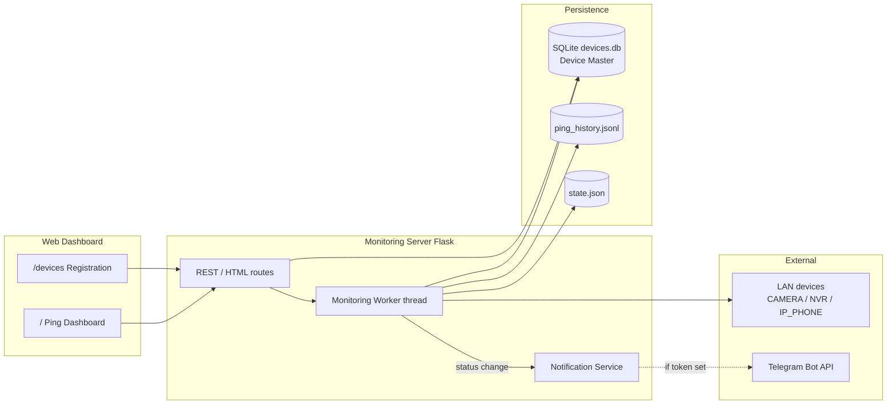

# Phase 1 — System Foundation Architecture

**Project path:** `C:\dev\software\camera-uptime-monitor`  
**Dashboard:** http://127.0.0.1:8099/  
**Scope (Phase 1):** architecture, Device Master DB, Device Registration UI.  
**Later phases:** richer worker scheduling, NVR/IP phone probes, Telegram bot commands.

## Components

| Component | Role (Phase 1) | Tech |
|-----------|----------------|------|
| **Monitoring Server** | Flask app host; REST + HTML pages | `src/webapp.py` |
| **Database** | Device Master + ping/history state | SQLite `data/devices.db` + JSONL history |
| **Monitoring Worker/Service** | Background ping loop (hourly) + on-demand Test Connection | thread in web process / `src/core.py` |
| **Web Dashboard** | Ping status + Network Devices admin | `/`, `/devices` |
| **Notification Service** | Optional Telegram send on OFFLINE/ONLINE | `src/core.py` → Telegram Bot API |
| **Telegram Bot** | Phase 1: outbound alerts only (token in `.env`). Inbound commands = later | BotFather token |
| **Device Master** | Source of truth for all monitored assets | `devices` table |

## Communication (Phase 1)

### Flows

1. **Register device** — Admin UI → Server → insert/update `devices` row (optional reference image on disk).
2. **Test Connection** — UI → Server → ICMP + type-aware TCP probe (CAMERA/NVR: port 554 default; IP_PHONE: 5060/80) → return ONLINE/OFFLINE to UI; optionally refresh `status`.
3. **Scheduled monitor** — Worker reads `isActive=1` devices → probe → write status + history → Notification Service if status flipped to OFFLINE (or recovery).
4. **Telegram** — Notification Service POSTs to `api.telegram.org` when `.env` has bot token + chat id. No Telegram required for web to work.

## Device status enum

`ONLINE` | `OFFLINE` | `WARNING` | `UNDER_MAINTENANCE` | `UNKNOWN`

## Device type enum

`CAMERA` | `NVR` | `IP_PHONE`

## Phase 1 deliverables map

| Task | Deliverable |
|------|-------------|
| 1.1 | This document (`docs/architecture.md`) |
| 1.2 | `devices` table in `data/devices.db` (`src/db.py`) |
| 1.3 | Network Devices UI at `/devices` |

## Out of scope for Phase 1

- Separate OS service process (worker still in-process)
- Telegram interactive bot (commands)
- Full NVR channel matrix sync
- Auth / multi-user login

## Phase 2 — Monitoring Engine

| Task | Deliverable |
|------|-------------|
| 2.1 Monitoring Worker | src/worker.py — continuous loop, due-device scheduling via `nextCheckAt`, incidents |
| 2.2 ICMP Ping | src/icmp.py — responseTime, packetLoss, success, error; confirmation retry on fail |
| 2.3 Health Check History | `healthChecks` table + /health-checks + per-device History + `last_successful_check` |

Worker poll interval: 15s (only devices with `nextCheckAt <= now`). Per-device interval: `CHECK_INTERVAL_SEC` (default 3600).

## Phase 3 — Hourly Mandatory Monitoring

| Task | Deliverable |
|------|-------------|
| 3.1 Hourly scheduler | Standalone `python -m src.worker` (Startup runs worker + web separately). Every active device gets MANDATORY ICMP each hour (24/day). Does not need the dashboard browser open. |
| 3.2 Missed checks | `monitoringWarnings` with `MISSED_CHECK` when last MANDATORY &gt; 1 hour. UI: `/warnings`. |
| 3.3 Check kinds | `healthChecks.checkKind`: MANDATORY, RANDOM, MANUAL, CONFIRMATION |

Scripts: `scripts\run-worker.ps1`, `scripts\run-web.ps1`, `scripts\run-all.ps1`.
